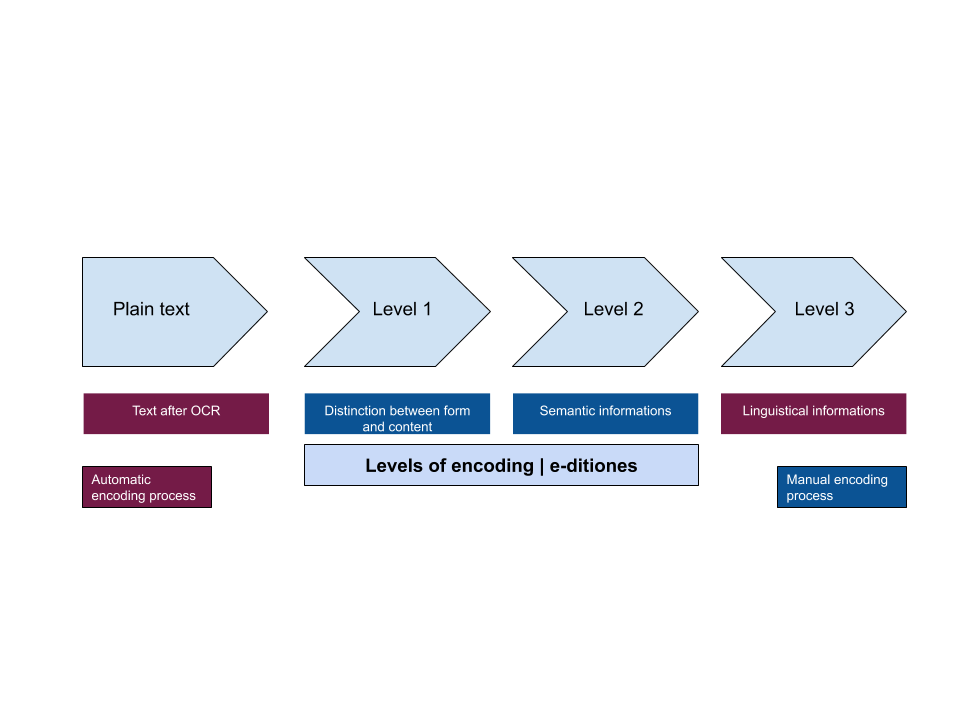
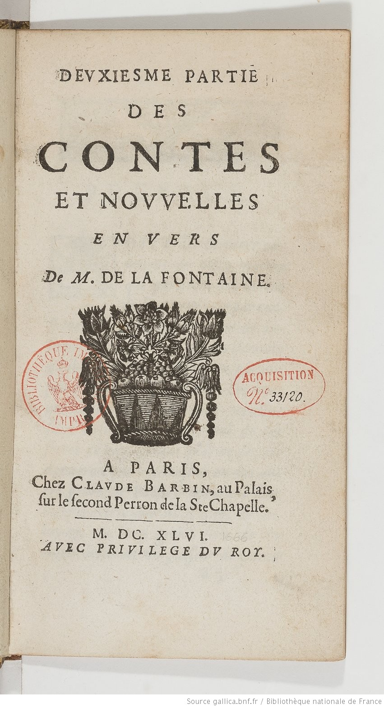
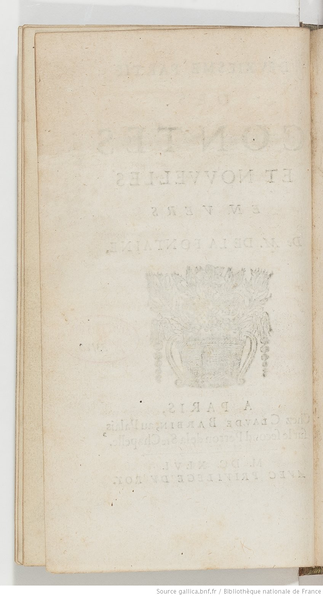
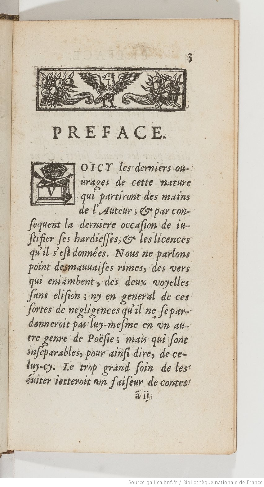
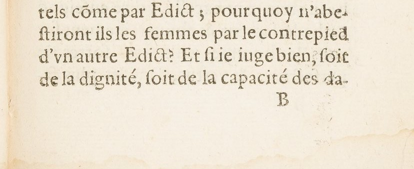

# Encoding guidelines - project *E-ditiones*

How to encode documents according *E-ditiones* schemas.

There are 3 different levels



There are 5 different schemas


## Encoding logic

When encoding, we always have to correct small typos, etc. In order to prevent having a different transcription for the same document:
1. Level 2 encoding is considered the last state of the document
2. If, and only if, there is no level 2 encoding, it is the level 1 that is considered the master file.

In order to prevent any inconsistency, when a document is entirely encoded in level 2, it is back-converted into level 1 thanks to the [`level2to1.xsl`](https://github.com/e-ditiones/ODD17/blob/master/level2to1.xsl).

## Using the schemas

Schemas can be downloaded and used locally by adjusting the `@href`

```xml
<?xml-model href="/path/to/ODD-header_MS.rng"
            type="application/xml"
            schematypens="http://purl.oclc.org/dsdl/schematron"?>
```

It is also possible to link the `xml` file to the schemas online (validation against the schema will be be possible only if the computer is connected to the internet).

```xml
<?xml-model href="https://raw.githubusercontent.com/e-ditiones/ODD17/master/out/ODD-header_MS.rng"
type="application/xml" schematypens="http://relaxng.org/ns/structure/1.0"?>
```

### `<teiHeader>`

For each level, there are five different `<?xml-model>`
1. Manuscript header

Local version

```xml
<?xml-model href="/path/to/ODD-header_MS.rng"
            type="application/xml"
            schematypens="http://purl.oclc.org/dsdl/schematron"?>
```

Online version
```xml
<?xml-model href="https://raw.githubusercontent.com/e-ditiones/ODD17/master/out/ODD-header_MS.rng"
type="application/xml" schematypens="http://relaxng.org/ns/structure/1.0"?>
```

2. Print header

Local version
```xml
<?xml-model href="/path/to/ODD-header_printed.rng"
			type="application/xml"
            schematypens="http://purl.oclc.org/dsdl/schematron"?>
```

Online version
```xml
<?xml-model href="https://raw.githubusercontent.com/e-ditiones/ODD17/master/out/ODD-header_printed.rng"
			type="application/xml"
			schematypens="http://relaxng.org/ns/structure/1.0"?>
```

### `<text>`

3. Level 1

Local version
```xml
<?xml-model href="/path/to/ODD-1.rng"
			type="application/xml"
            schematypens="http://purl.oclc.org/dsdl/schematron"?>
```

Online version
```xml
<?xml-model href="https://raw.githubusercontent.com/e-ditiones/ODD17/master/out/ODD-1.rng"
			type="application/xml"
			schematypens="http://relaxng.org/ns/structure/1.0"?>
```

4. Level 2

Local version
```xml
<?xml-model href="/path/to/ODD-2.rng"
			type="application/xml"
            schematypens="http://purl.oclc.org/dsdl/schematron"?>
```

Online version
```xml
<?xml-model href="https://raw.githubusercontent.com/e-ditiones/ODD17/master/out/ODD-2.rng"
			type="application/xml"
			schematypens="http://relaxng.org/ns/structure/1.0"?>
```
5. Level 3

Local version
```xml
<?xml-model href="/path/to/ODD-3.rng"
			type="application/xml"
            schematypens="http://purl.oclc.org/dsdl/schematron"?>
```

Online version
```xml
<?xml-model href="https://raw.githubusercontent.com/e-ditiones/ODD17/master/out/ODD-3.rng"
			type="application/xml"
			schematypens="http://relaxng.org/ns/structure/1.0"?>
```


### Example

We will take the example of Jean de La Fontaine, _Deuxiesme partie des Contes et nouvelles en vers, de M. de La Fontaine_, Paris: C. Barbin, 1666. The book is available online: [ark:/12148/bpt6k319141c](https://gallica.bnf.fr/ark:/12148/bpt6k319141c)

  


---
### Encoding

Documents are not encoded in one single file, starting with `<TEI xmlns="http://www.tei-c.org/ns/1.0">` such as

```xml
<?xml version="1.0" encoding="UTF-8"?>
<?xml-model href="http://www.tei-c.org/release/xml/tei/custom/schema/relaxng/tei_all.rng" type="application/xml" schematypens="http://relaxng.org/ns/structure/1.0"?>
<?xml-model href="http://www.tei-c.org/release/xml/tei/custom/schema/relaxng/tei_all.rng" type="application/xml"
	schematypens="http://purl.oclc.org/dsdl/schematron"?>
<TEI xmlns="http://www.tei-c.org/ns/1.0">
  <teiHeader>
      <fileDesc>
         <titleStmt>
            <title>Title</title>
         </titleStmt>
         <publicationStmt>
            <p>Publication Information</p>
         </publicationStmt>
         <sourceDesc>
            <p>Information about the source</p>
         </sourceDesc>
      </fileDesc>
  </teiHeader>
  <text>
      <body>
         <p>Some text here.</p>
      </body>
  </text>
</TEI>

```

The `<teiHeader>` and the `<text>` are encoded separately:

```xml
<?xml version="1.0" encoding="UTF-8"?>
<?xml-model href="../out/ODD-header_printed.rng" type="application/xml" schematypens="http://relaxng.org/ns/structure/1.0"?>
<teiHeader  xmlns="http://www.tei-c.org/ns/1.0">
  …
</teiHeader>
```

```xml
<?xml version="1.0" encoding="UTF-8"?>
<?xml-model href="../out/ODD-1.rng" type="application/xml" schematypens="http://relaxng.org/ns/structure/1.0"?>
<text xmlns="http://www.tei-c.org/ns/1.0" xml:id="EXP_0013">
  …
</text>
```

---
### Header

A typical header for a print is the following:

```xml
<?xml version="1.0" encoding="UTF-8"?>
<?xml-model href="../out/ODD-header_printed.rng" type="application/xml" schematypens="http://relaxng.org/ns/structure/1.0"?>
<teiHeader  xmlns="http://www.tei-c.org/ns/1.0">
   <fileDesc>
      <titleStmt>
         <title type="main">Deuxiesme partie des Contes et nouvelles en vers</title>
        <!-- @sub specifies that it is the E-Ditiones edition -->
         <title type="sub">E-Ditiones edition</title>
         <!-- We use isni as an ID for people. If it does not exist, we can use VIAF, IDref… -->
         <author ref="isni:0000000120958636">La Fontaine, Jean de</author>
         <!-- If an id is not available for a scholar, we can use ORCID -->
         <editor ref="orcid:0000-0001-9094-4475">Simon Gabay</editor>
      </titleStmt>
      <extent>
         <!-- for measure, we use the number of images in the pdf -->
         <measure unit="images" n="189"/>
         <!-- if available, we add the number of words-->
        <measure unit="words" n="000"/>
      </extent>
     <!-- the publicationStmt is stable -->
      <publicationStmt>
         <publisher>E-Ditiones project</publisher>
         <ref target="https://github.com/e-ditiones"/>
         <availability status="restricted" n="cc-by">
            <licence target="https://creativecommons.org/licenses/by/4.0"/>
         </availability>
      </publicationStmt>
      <sourceDesc>
         <bibl>
            <ref target="https://catalogue.bnf.fr/ark:/12148/cb30715682t"/>
            <author ref="isni:0000000120958636">La Fontaine, Jean de</author>
            <title>Deuxiesme partie des Contes et nouvelles en vers, de M. de La Fontaine</title>
            <!-- for cities, we use geonames as a gazetteer -->
            <pubPlace ref="geonames:2988507">Paris</pubPlace>
            <publisher ref="isni:0000000121252707">C. Barbin</publisher>
            <date when="1666">1666</date>
         </bibl>
      </sourceDesc>
   </fileDesc>
   <revisionDesc>
      <change who="orcid:0000-0001-9094-4475" when="2020-05-26">Adaptation of the XML-TEI encoding according to the new ODD</change>
   </revisionDesc>
</teiHeader>
```

---
### Level 1

Level 1 encoding

```xml
<?xml version="1.0" encoding="UTF-8"?>
<?xml-model href="../out/ODD-1.rng" type="application/xml" schematypens="http://relaxng.org/ns/structure/1.0"?>
<text xmlns="http://www.tei-c.org/ns/1.0" xml:id="EXP_0013">
   <body>
      <p>
         <pb n="" facs="https://gallica.bnf.fr/ark:/12148/bpt6k319141c/f9"/>
         <lb/>DEVXIESME PARTIE
         <lb/>DES
         <lb/>CONTES
         <lb/>ET NOVVELLES
         <lb/>ENVERS
         <lb/>De M. DE LA FONTAINE.
         <lb/>A PARIS,
         <lb/>Chez CLAVDE BARBIN, au Palais,
         <lb/>ſur le ſecond Perron de la Ste Chapelle.
         <lb/>M. DC. XLVI.
         <pb n="" facs="https://gallica.bnf.fr/ark:/12148/bpt6k319141c/f10"/>
         <pb n="" facs="https://gallica.bnf.fr/ark:/12148/bpt6k319141c/f11"/>
         <fw><lb/>3</fw>
         <lb/>PREFACE
         <lb/>OICY les derniers ou¬<lb break="no"/>urages de cette nature
         <lb/>qui partiront des mains
         <lb/>de l'Auteur; &amp; par con¬<lb break="no"/>ſequent la derniere occaſion de iu¬<lb break="no"/>ſtifier ſes hardieſſes;, &amp; les licences
         <lb/>qu'il s'eſt données. Nous ne parlons
         <lb/>point desmauuaiſes rimes, des vers
         <lb/>qui eniambent, des deux voyelles
         <lb/>ſans eliſion; ny en general de ces
         <lb/>ſortes de negligences qu’il ne ſe par¬<lb break="no"/>donneroit pas luy-meſme en vn au¬<lb break="no"/>tre genre de Poëſie; mais qui ſont
         <lb/>inſeparables, pour ainſi dire, de ce¬<lb break="no"/>luy-cy. Le trop grand ſoin de les:
         <lb/>euiter ietteroit vn faiſeur de contess
         <fw><lb/>ã ij
            <pb n="" facs="https://gallica.bnf.fr/ark:/12148/bpt6k319141c/f12"/>
            <lb/>4 PREFACE.</fw>
```

---
### Level 2

```xml
<?xml version="1.0" encoding="UTF-8"?>
<?xml-model href="../out/ODD-2.rng" type="application/xml" schematypens="http://relaxng.org/ns/structure/1.0"?>
<text  xmlns="http://www.tei-c.org/ns/1.0" xml:id="EXP_0013">
   <front>
      <div type="titlePage">
         <pb n="" facs="https://gallica.bnf.fr/ark:/12148/bpt6k319141c/f9"/>
         <p>
            <lb/>DEVXIESME PARTIE
            <lb/>DES
            <lb/>CONTES
            <lb/>ET NOVVELLES
            <lb/>ENVERS
            <lb/>De M. DE LA FONTAINE.
            <lb/>A PARIS,
            <lb/>Chez CLAVDE BARBIN, au Palais,
            <lb/>ſur le ſecond Perron de la Ste Chapelle.
            <lb/>M. DC. XLVI.
         </p>
         <pb n="" facs="https://gallica.bnf.fr/ark:/12148/bpt6k319141c/f10"/>
         <pb n="" facs="https://gallica.bnf.fr/ark:/12148/bpt6k319141c/f11"/>
      </div>
   </front>
   <body>
      <fw><lb/>3</fw>
      <div type="liminal">
         <head><lb/>PREFACE</head>
         <p>
            <lb/>OICY les derniers ou¬<lb break="no"/>urages de cette nature
            <lb/>qui partiront des mains
            <lb/>de l'Auteur; &amp; par con¬<lb break="no"/>ſequent la derniere occaſion de iu¬<lb break="no"/>ſtifier ſes hardieſſes;, &amp; les licences
            <lb/>qu'il s'eſt données. Nous ne parlons
            <lb/>point desmauuaiſes rimes, des vers
            <lb/>qui eniambent, des deux voyelles
            <lb/>ſans eliſion; ny en general de ces
            <lb/>ſortes de negligences qu’il ne ſe par¬<lb break="no"/>donneroit pas luy-meſme en vn au¬<lb break="no"/>tre genre de Poëſie; mais qui ſont
            <lb/>inſeparables, pour ainſi dire, de ce¬<lb break="no"/>luy-cy. Le trop grand ſoin de les:
            <lb/>euiter ietteroit vn faiſeur de contess
            <fw><lb/>ã ij
               <pb n="" facs="https://gallica.bnf.fr/ark:/12148/bpt6k319141c/f12"/>
               <lb/>4 PREFACE.</fw>
```

## Technicalities

### A `<pb>`in the middle of a word




```xml
<lb/>d'vn autre Edict? Et ſi ie iuge bien, ſoit
<lb/>de la diginité, ſoit de la capacité des da¬
<fw><lb/>B
	<pb n="10" facs="https://gallica.bnf.fr/ark:/12148/bpt6k3142288/f24"/>
	<lb/>10 Egalite des Hommes</fw>
<lb break="no"/>mes, ie ne pretends pas à cette heure de
```
Words **are not** reconstituted artificially

```xml
<lb/>d'vn autre Edict? Et ſi ie iuge bien, ſoit
<lb/>de la diginité, ſoit de la capacité des dames,
<fw><lb/>B
	<pb n="10" facs="https://gallica.bnf.fr/ark:/12148/bpt6k3142288/f24"/>
	<lb/>10 Egalite des Hommes</fw>
<lb/>ie ne pretends pas à cette heure de
```
### Position of the `<lb/>`


We try to keep the `<lb/>` nested at the lowest granularity level, within the `<fw>` for instance.

```xml
<lb/>d'vn autre Edict? Et ſi ie iuge bien, ſoit
<lb/>de la diginité, ſoit de la capacité des dames,
<fw><lb/>B
	<pb n="10" facs="https://gallica.bnf.fr/ark:/12148/bpt6k3142288/f24"/>
	<lb/>10 Egalite des Hommes</fw>
<lb/>ie ne pretends pas à cette heure de
```

###  Blank pages
* Blank pages before the first printed page  **do not have to be encoded ** with `<pb/>`
* Blank pages after the last printed page  **do not have to be encoded ** with `<pb/>`
* Blank pages in between printed pages **have to be encoded** with `<pb/>`
```xml
<pb n="" facs="https://gallica.bnf.fr/ark:/12148/bpt6k319141c/f10"/>
<pb n="" facs="https://gallica.bnf.fr/ark:/12148/bpt6k319141c/f11"/>
```