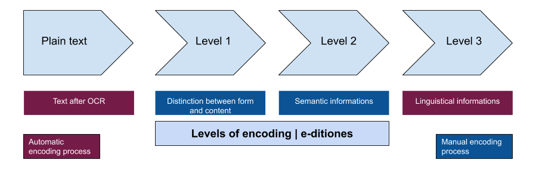

# Encoding French modern manuscripts and printed documents

Schemas and documentation for the _E-ditiones_ project.

## Encoding levels

The metadata and the transcriptions both have their own schemas.

* Two for the `<teiHeader>` (metadata)
  * One for prints
  * One for manuscripts
* Three for the `<text>` (transcription)
  * Level 1 : the encoding will distinguish form and content
  * Level 2 : we will add semantic informations
  * Level 3 : we will add linguistical informations

 

 
 

## ODD-chaining

All these schemas are related to one another thanks to ODD-chaining.

 
 

 

All the documents used to create the sub-schemas are available in this repo.
1. `Mother.xml` contains all the elements that are used in the sub-sechemas. 
2. `Mother-ODD.xml`: `Mother.xml` transformed with `oddbyexample.xsl`
3. `Mother-compiled.xml`: `Mother-ODD.xml` transformed with `odd2odd.xsl`

You can learn more about the process on [wiki.tei-c.org](https://wiki.tei-c.org/index.php/ODD_chaining) or with this [tutorial](https://github.com/TEIC/TEI/tree/e375991d8155fe619f429be5774e3c75022e1e87/Documents/pureODD) by Lou Burnard.

## Schemas

This repository contains all the schemas of the _E-ditiones_ project in the RELAX NG language.

You will find six specific schemas, there are schemas for :
* [one for the header of a manuscript](https://github.com/e-ditiones/ODD17/blob/master/schemas/ODD-header_MS.rng) 
* [one for the header of a printed document](https://github.com/e-ditiones/ODD17/blob/master/schemas/ODD-header_printed.rng)
* [one for the text at level 1](https://github.com/e-ditiones/ODD17/blob/master/schemas/ODD-1.rng)
* [one for the text at level 2](https://github.com/e-ditiones/ODD17/blob/master/schemas/ODD-2.rng)
* [one for the text at level 3](https://github.com/e-ditiones/ODD17/blob/master/schemas/ODD-3.rng)
* [one for all the possible combinations of the previous schemas](https://github.com/e-ditiones/ODD17/blob/master/schemas/Mother-ODD.rng)

## Guidelines

If you need more details, we wrote an [**encording manual**](https://github.com/e-ditiones/ODD17/blob/master/Encoding_manual.md) which explains how to encode your file step by step.

### Documentation

The documentation of this project is available in the folder [Documentation](https://github.com/e-ditiones/ODD17/blob/master/Documentation). 
You can find the XML version in the file [ODD-body.xml](https://github.com/e-ditiones/ODD17/blob/master/Documentation/ODD-body.xml).

### Examples

Some examples are available in the folder [Examples](https://github.com/e-ditiones/ODD17/tree/master/Examples).

Each file is named according to its content : `Identifier.xml` matches the header of the file and `Identifier_Level-of-encoding.xml` matches the text. For example, `EXP_0001-1.xml` matches with the text (as *transcription*) which has the identifier `EXP_0001` at level 1.

**Please note that we are still working on the best way to form a complete file.**

Click here to see an exemple of an encoding following each schemas : 
* [header of a manuscript](https://github.com/e-ditiones/ODD17/blob/master/Examples/EXP_0007_header.xml)
* [header of a print](https://github.com/e-ditiones/ODD17/blob/master/Examples/EXP_0003_header.xml)
* [text at level 1](https://github.com/e-ditiones/ODD17/blob/master/Examples/EXP_0002_level-1_text.xml)
* [text at level 2](https://github.com/e-ditiones/ODD17/blob/master/Examples/EXP_0002_level-2_text.xml)
* text at level 3

## Credits

This repository is developed by Alexandre Bartz with the help of Simon Gabay, as part of the [_E-ditiones_](https://github.com/e-ditiones) project.

## Licence

This repository is CC-BY-SA.
 

## Cite this repository

Alexandre Bartz, Simon Gabay. 2020. _Encoding principles for French modern manuscripts and printed documents_. Retrieved from https://github.com/e-ditiones/ODD17.

