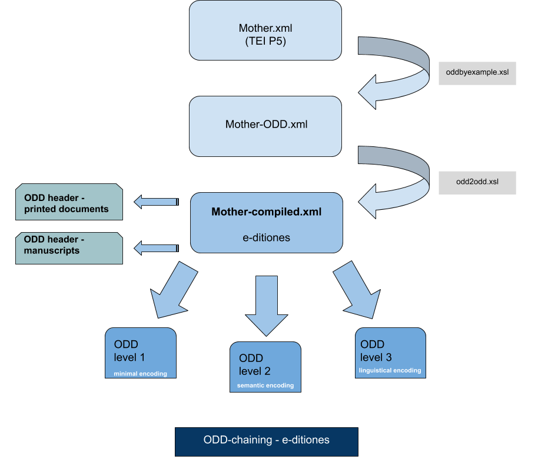

# Encoding French modern manuscripts and printed documents

Schemas and documentation for the encoding of french modern (17th c.) manuscripts and printed documents.

## Introduction

To encode those documents, we chose to use ODD-chaining. The following diagram explains how we did it :

First, we created a file `Mother.xml`containing all the elements that we will use during encoding, then we process a first transformation with `oddbyexample.xml`.
We process on the output file, `Mother-ODD.xml`, an other transformation with `odd2odd`. The final output file, `Mother-compiled.xml`is used for the ODD-chaining process.

You can learn more about it [here](https://wiki.tei-c.org/index.php/ODD_chaining).

## Schemas

This repository contains all the schemas in RELAXNG of the project e-ditiones.
Note that all texts must be valid against these schemas.

You will find five specific schemas, there are schemas for :
* the header of a manuscript 
* the header of a printed document
* the text at level 1
* the text at level 2
* the text at level 3

## Documentation

The documentation of this project is available in the folder `Documentation`. 
The XML version is available in the file `ODD-body.xml`.

## Examples

You can find an example for each schema in the folders `Headers`and `Textes`.

## Credits

This repository is developed by Alexandre Bartz with the help of Simon Gabay, as part of the project [e-ditiones](https://github.com/e-ditiones).

## Licence

This repository is CC-BY.
 

## Cite this repository

Alexandre Bartz, Simon Gabay. 2019. _Encoding principles for French modern manuscripts and printed documents_. Retrieved from https://github.com/alexbartz/E-ditiones.

